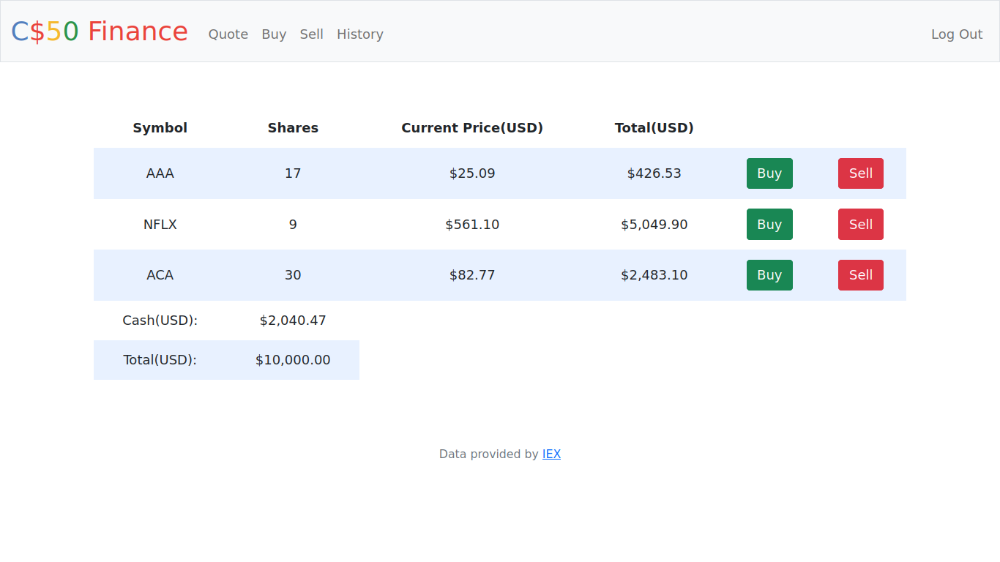

# Finance 
Finance é um aplicativo web, desenvolvido como parte do PSET 9 do curso CS50, feito com Flask, que permite aos usuários logados “comprar” e “vender” ações, bem como consultar cotações de ações reais obtidas na API IEX. Os usuários também podem visualizar o histórico de transações da sua carteira de ações. 

## Tecnologias
* Python
* Flask
* SQLite
* HTML
* Bootstrap

## Funcionalidades
* Registro/Login
* Pesquisa de preços de ações
* Simulação de compra de ações
* Simulação de venda de ações
* Ver ações compradas e o atual preço de cada uma
* Histórico de transações

